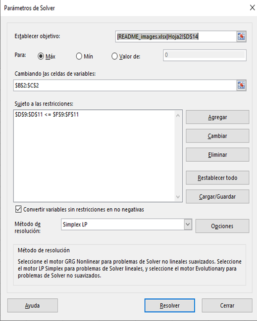
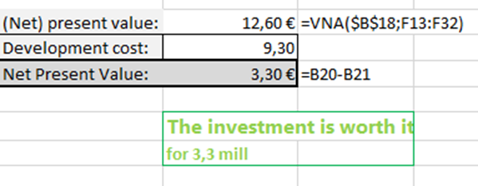
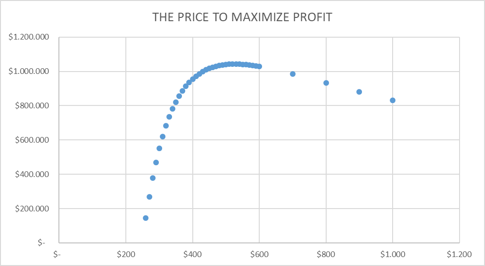
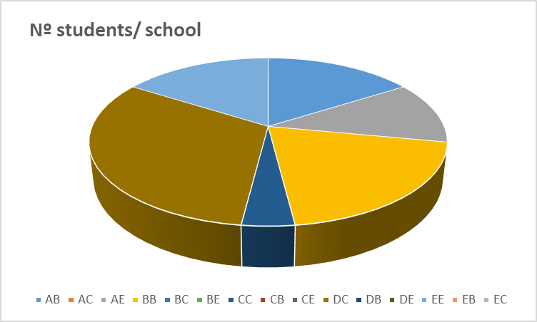
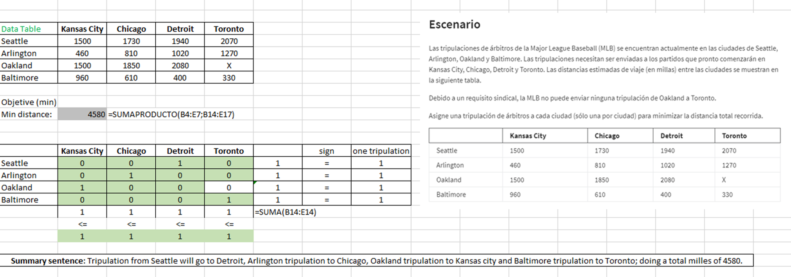
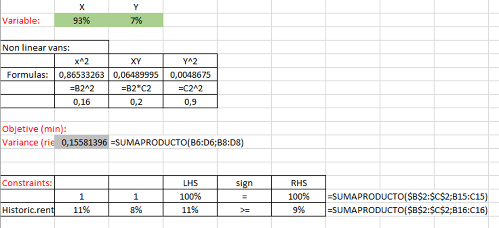
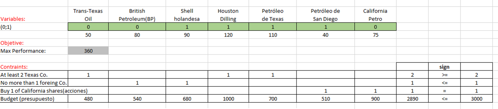

# Excel_proyects_mathematical_optimization_mode
   

## Excel Exercises: Optimization and Financial Analysis Exercises.

This repository contains a collection of Excel exercises focusing on various topics including: Value Analysis (VAN), Return on Investment (ROI), Linear Progression, Non-linear Progression, Mixed Integer Programming and Calculating Price to Maximize Profits:
1. **VAN_or_NPV**
2. **price_for_Max_profit** 
3. **Linear_Progression** 
4. **LP_Transport_and_asssigment** 
5. **Non-linear Progression**
6. **Mixed_Integer_example**
7. **Bluejay_Natural_Gas_Financials_project**

## Contents of the Excel Files

1. **VAN_or_NPV:**
Excel file with exercises involving calculating the Net Present Value (NPV) of investment projects using Excel formulas; very useful to determine whether a project will be profitable or not.

   

2. **price_for_Max_profit:** 
Here, you'll find Excel exercises related to calculate the optimal price to maximize profits.

    Sell at a price of 530 dolars for a profit of 1042 dolars.

   
3. **Linear_Progression:** 
This section covers exercises that involve linear regression analysis using Excel: It's about finding the best solution to a problem, subject to certain constraints, when all relationships between the variables involved are linear; optimizing, maximizing, or minimizing a linear function (called the objective function) while satisfying a series of linear constraints.

   This image shows the result of one of exercises:

4. **LP_Transport_and_asssigment:** 
Here, there are linear programming problems about to allocate resources (such as products) from different sources (like factories) to various destinations (like warehouses) efficiently and at the lowest possible cost. It involves finding the best way to transport items from one place to another, considering constraints such as transportation capacity and demand at each destination. Such problems are commonly encountered in logistics, resource distribution, and task allocation.

5. **Non-linear Progression:** Exercises in this section focus on non-linear regression analysis and modeling using Excel; It is used to solve problems where the relationships between the involved variables are not linear, which means they do not follow a straight line on a graph. Instead, they can have curves or more complicated shapes. This technique is useful for optimizing functions that cannot be represented linearly and is employed in a variety of fields.

   

6. **Mixed_Integer_example:**
These are optimization problems in which some of the variables being optimized must be integers (they cannot have decimal values), while others can have fractional values.

   

## Contributing

Contributions to this repository are welcome! If you have additional exercises, improvements, or corrections, feel free to submit a pull request or open an issue to discuss changes.

## Acknowledgments

Special thanks to Joseph W. Cutrone for contributing exercises to this repository.

## Contact

For questions or inquiries, please contact Marta Moral at mmoralmh@gmail.com.